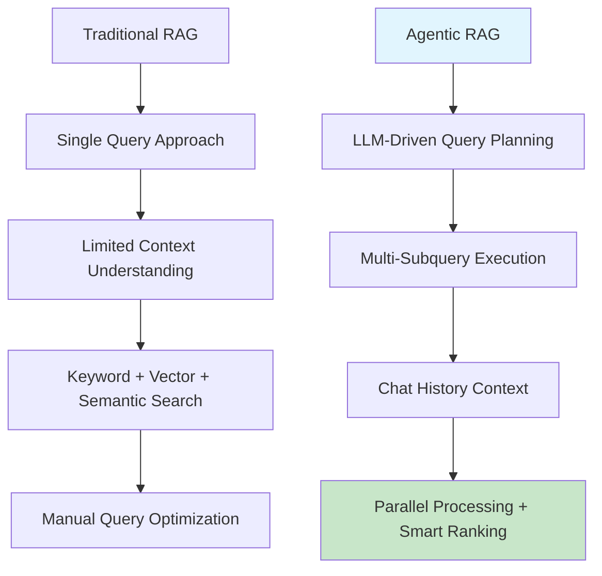

# Azure AI Search: Agentic vs Hybrid Search
## Introduction to Modern Search Patterns

---

### 🎯 Presentation Overview

This presentation explores the evolution from traditional hybrid search patterns to Azure AI Search's new **agentic retrieval** capabilities, designed for developers building RAG (Retrieval-Augmented Generation) applications.

### 📋 What We'll Cover

1. **Traditional RAG Limitations** - Understanding current hybrid search constraints
2. **Agentic Search Advantages** - Key benefits and breakthrough capabilities  
3. **Implementation Deep Dive** - Required classes and architecture patterns
4. **Semantic Kernel Integration** - Practical implementation with chat completion

### 🏗️ Architecture Evolution Flow

### 🎯 Target Audience

**Technical professionals familiar with:**
- Traditional RAG patterns and hybrid search
- Azure AI Search basic concepts (keyword, vector, semantic search)
- Building conversational AI applications
- .NET/C# development with Semantic Kernel

### ⚡ Key Takeaways Preview

- **Query Intelligence**: LLM-powered query breakdown and optimization
- **Parallel Execution**: Multiple subqueries running simultaneously
- **Context Awareness**: Chat history integration for better relevance
- **Unified Results**: Structured responses with grounding data

---

*Let's dive into how agentic search transforms the traditional RAG experience...*
