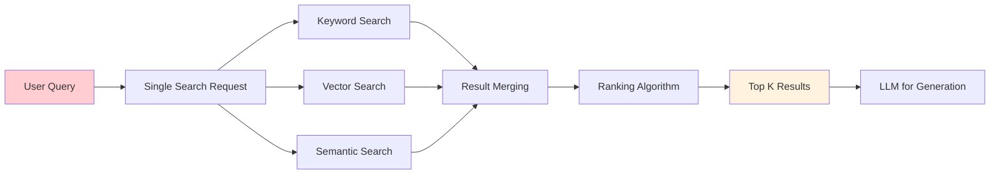
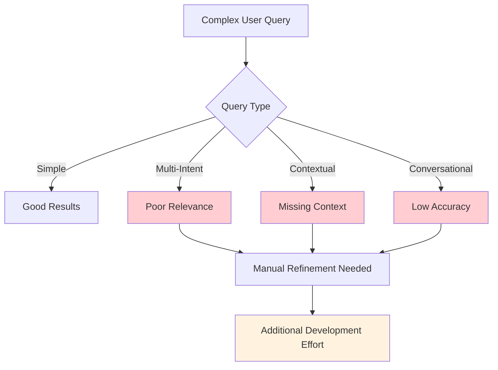

# Traditional RAG: Hybrid Search Limitations
## Understanding Current Search Constraints

---

### 🔍 Traditional Hybrid Search Architecture

In traditional RAG applications, search queries follow a predictable but limited pattern:



### ⚠️ Key Limitations of Traditional Hybrid Search

#### 1. **Single Query Constraint**
```csharp
// Traditional approach - one query at a time
var searchOptions = new SearchOptions
{
    QueryType = SearchQueryType.Semantic,
    SearchMode = SearchMode.All,
    Size = 50
};

var response = await searchClient.SearchAsync<Document>(
    "find hotels near beach with transportation", 
    searchOptions);
```

**Problem**: Complex queries with multiple intents get diluted results

#### 2. **No Chat Context Awareness**
- Each query is processed in isolation
- No understanding of conversation history
- Missing context from previous interactions
- Users must repeat context in each query

#### 3. **Manual Query Optimization**
```csharp
// Developers must manually handle query expansion
var expandedQuery = userQuery + " OR " + GetSynonyms(userQuery);
var spellingCorrected = await SpellCheck(expandedQuery);
```

**Problem**: Requires extensive manual preprocessing and optimization

#### 4. **Limited Query Understanding**
- No decomposition of compound questions
- Spelling mistakes reduce relevance
- No automatic synonym expansion
- Poor handling of conversational queries

### 📊 Performance Impact Analysis



### 🛠️ Current Developer Workarounds

#### Query Preprocessing Pipeline
```csharp
public class TraditionalSearchService
{
    public async Task<SearchResults> ProcessQuery(string query, List<string> chatHistory)
    {
        // Manual preprocessing required
        var correctedQuery = await SpellCheckAsync(query);
        var expandedQuery = await ExpandSynonymsAsync(correctedQuery);
        var contextualQuery = BuildContextFromHistory(expandedQuery, chatHistory);
        
        // Single search execution
        return await ExecuteHybridSearch(contextualQuery);
    }
    
    private string BuildContextFromHistory(string query, List<string> history)
    {
        // Manual context building - error prone and limited
        return $"{string.Join(" ", history.TakeLast(3))} {query}";
    }
}
```

### 🎯 Real-World Example: Hotel Search

**User Intent**: *"Find me a hotel near the beach, with airport transportation, and that's within walking distance of vegetarian restaurants."*

#### Traditional Approach Result:
- **Single Query**: Searches for all terms together
- **Result**: Mixed relevance, may miss hotels strong in one aspect
- **Ranking**: Generic scoring across all criteria
- **Context**: No understanding this is a multi-requirement search

#### Developer Must Handle:
1. Manual query breakdown
2. Multiple search requests
3. Custom result merging logic
4. Context preservation across queries

---

*Next: How agentic search solves these fundamental limitations...*
