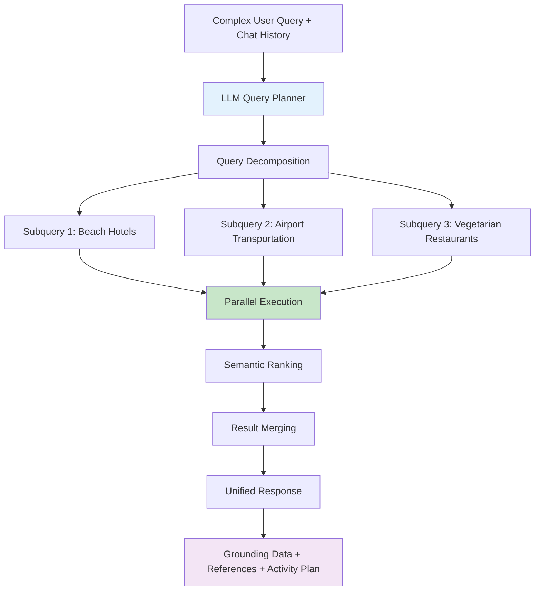
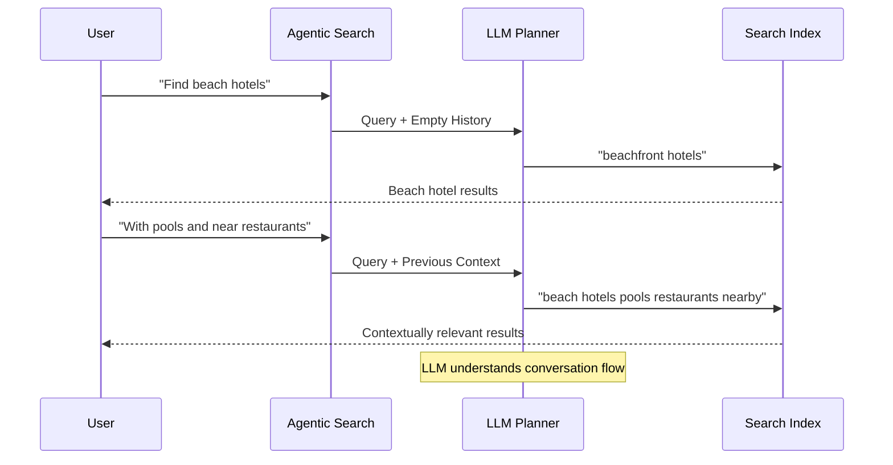
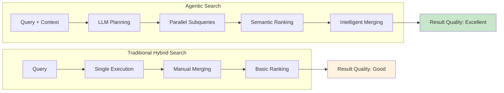

# Agentic Search Advantages
## Breaking Through Traditional Limitations

---

### 🚀 What Makes Agentic Search Revolutionary

Agentic retrieval introduces **LLM-powered query intelligence** that fundamentally changes how search queries are processed and executed.



### ✨ Core Advantages Over Hybrid Search

#### 1. **Intelligent Query Decomposition**

**Traditional Approach:**
```csharp
// Single monolithic query
var query = "find hotels near beach with airport transportation vegetarian restaurants";
var results = await searchClient.SearchAsync<Hotel>(query, searchOptions);
```

**Agentic Approach:**
```csharp
// LLM automatically breaks down into focused subqueries
var agenticRequest = new AgenticRetrievalRequest
{
    Query = "find hotels near beach with airport transportation vegetarian restaurants",
    ChatHistory = previousMessages,
    MaxSubqueries = 5
};

// Results in multiple optimized subqueries:
// 1. "beachfront hotels waterfront accommodation"
// 2. "airport shuttle transportation hotel"  
// 3. "vegetarian restaurants walking distance hotels"
```

#### 2. **Chat History Integration**



#### 3. **Automatic Error Correction & Enhancement**

| Traditional Challenge | Agentic Solution |
|---------------------|------------------|
| Spelling mistakes reduce relevance | LLM automatically corrects spelling |
| Manual synonym expansion required | Built-in semantic understanding |
| No query context | Chat history provides context |
| Single query execution | Parallel subquery execution |

#### 4. **Parallel Processing Performance**

```csharp
// Traditional: Sequential processing
var hotelResults = await SearchHotels(query);
var restaurantResults = await SearchRestaurants(query);
var transportResults = await SearchTransport(query);

// Agentic: Automatic parallel execution
var agenticResponse = await knowledgeAgent.RetrieveAsync(new AgenticRequest
{
    Query = complexQuery,
    ChatHistory = conversationHistory
});
// All subqueries execute simultaneously
```

### 📊 Performance Comparison



### 🎯 Real-World Benefits

#### **Hotel Search Example Revisited**

**Query**: *"Find me a hotel near the beach, with airport transportation, and that's within walking distance of vegetarian restaurants."*

**Agentic Processing:**
1. **LLM Analysis**: Identifies 3 distinct requirements
2. **Subquery Generation**:
   - `"beachfront hotels oceanfront accommodation"`
   - `"airport shuttle hotel transportation service"`  
   - `"vegetarian restaurants walking distance accommodation"`
3. **Parallel Execution**: All 3 searches run simultaneously
4. **Intelligent Merging**: Results combined with relevance weighting
5. **Structured Response**: Includes grounding data and execution plan

#### **Result Quality Improvements**

| Metric | Traditional | Agentic | Improvement |
|--------|------------|---------|-------------|
| Query Understanding | Manual parsing | LLM-driven analysis | ✅ Automatic |
| Context Awareness | None | Full chat history | ✅ Contextual |
| Spelling Tolerance | Poor | Automatic correction | ✅ Robust |
| Multi-intent Handling | Limited | Native support | ✅ Intelligent |
| Result Relevance | Good | Excellent | ✅ Superior |

### 💡 Key Capability Highlights

#### **1. Conversational Continuity**
```
User: "Find Italian restaurants in downtown"
→ Agentic search understands location context

User: "What about vegetarian options there?"
→ Automatically connects to previous downtown location
```

#### **2. Complex Query Handling**
```
Query: "Budget hotels with wifi near conference center but not too noisy"
→ Generates subqueries for: budget + hotels, wifi amenities, conference proximity, quiet locations
```

#### **3. Semantic Understanding**
```
Query: "Place to stay with good breakfast and easy commute to Microsoft"
→ LLM understands: hotels, breakfast quality, transportation to Microsoft offices
```

---

*Next: Deep dive into the implementation classes and architecture...*
