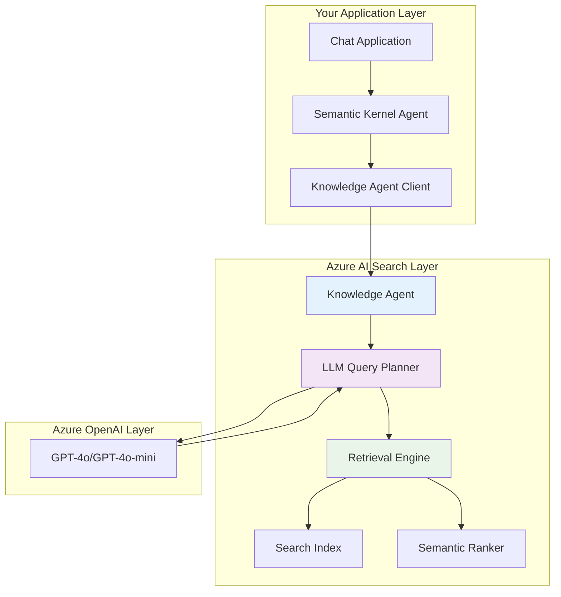

# Implementation Classes and Architecture
## Building Agentic Search Solutions

---

### 🏗️ Core Architecture Components

Azure AI Search agentic retrieval requires specific classes and configuration to implement the LLM-powered query planning pipeline.



### 📦 Required NuGet Packages

```xml
<PackageReference Include="Azure.Search.Documents" Version="11.6.0-beta.5" />
<PackageReference Include="Azure.AI.OpenAI" Version="2.1.0-beta.2" />
<PackageReference Include="Microsoft.SemanticKernel" Version="1.28.0" />
<PackageReference Include="Microsoft.SemanticKernel.Connectors.AzureAISearch" Version="1.28.0-preview" />
```

### 🔧 Essential Implementation Classes

#### **1. Knowledge Agent Configuration**

```csharp
using Azure;
using Azure.Search.Documents;
using Azure.Search.Documents.Models;

public class AgenticSearchConfiguration
{
    public string SearchServiceEndpoint { get; set; }
    public string SearchServiceApiKey { get; set; }
    public string IndexName { get; set; }
    public string OpenAIEndpoint { get; set; }
    public string OpenAIDeploymentName { get; set; }
    public string SemanticConfigurationName { get; set; }
}

public class KnowledgeAgentClient
{
    private readonly SearchClient _searchClient;
    private readonly AgenticSearchConfiguration _config;
    
    public KnowledgeAgentClient(AgenticSearchConfiguration config)
    {
        _config = config;
        var credential = new AzureKeyCredential(config.SearchServiceApiKey);
        _searchClient = new SearchClient(
            new Uri(config.SearchServiceEndpoint), 
            config.IndexName, 
            credential);
    }
}
```

#### **2. Knowledge Agent Setup**

```csharp
public class KnowledgeAgentService
{
    private readonly HttpClient _httpClient;
    private readonly AgenticSearchConfiguration _config;
    
    public async Task<string> CreateKnowledgeAgentAsync(string agentName)
    {
        var agentDefinition = new
        {
            name = agentName,
            description = "AI-powered search agent for contextual retrieval",
            instructions = "You are a helpful search assistant. Break down complex queries into focused subqueries for better retrieval.",
            tools = new[]
            {
                new
                {
                    type = "azure_ai_search",
                    azure_ai_search = new
                    {
                        connection_id = "default",
                        index_name = _config.IndexName,
                        semantic_configuration = _config.SemanticConfigurationName,
                        top_k = 50,
                        strictness = 3
                    }
                }
            },
            model = new
            {
                name = _config.OpenAIDeploymentName,
                provider = "azure_openai"
            }
        };
        
        var json = JsonSerializer.Serialize(agentDefinition);
        var content = new StringContent(json, Encoding.UTF8, "application/json");
        
        var response = await _httpClient.PostAsync(
            $"{_config.SearchServiceEndpoint}/knowledgeagents/{agentName}?api-version=2025-05-01-preview",
            content);
        
        response.EnsureSuccessStatusCode();
        return await response.Content.ReadAsStringAsync();
    }
}
```

#### **3. Agentic Retrieval Request Model**

```csharp
public class AgenticRetrievalRequest
{
    public string Query { get; set; }
    public List<ChatMessage> ChatHistory { get; set; } = new();
    public int MaxSubqueries { get; set; } = 3;
    public int MaxDocsPerSubquery { get; set; } = 50;
    public Dictionary<string, object> AdditionalProperties { get; set; } = new();
}

public class ChatMessage
{
    public string Role { get; set; } // "user", "assistant", "system"
    public string Content { get; set; }
    public DateTime Timestamp { get; set; }
}
```

#### **4. Agentic Response Model**

```csharp
public class AgenticRetrievalResponse
{
    public string UnifiedResult { get; set; }
    public List<SearchReference> References { get; set; } = new();
    public List<QueryActivity> Activities { get; set; } = new();
    public Dictionary<string, object> Metadata { get; set; } = new();
}

public class SearchReference
{
    public string DocumentId { get; set; }
    public string Title { get; set; }
    public string Content { get; set; }
    public double RelevanceScore { get; set; }
    public string SourceUrl { get; set; }
}

public class QueryActivity
{
    public string Subquery { get; set; }
    public int ResultCount { get; set; }
    public TimeSpan ExecutionTime { get; set; }
    public string SearchType { get; set; } // "keyword", "vector", "semantic"
}
```

### 🔍 Core Implementation Service

```csharp
public class AgenticSearchService
{
    private readonly KnowledgeAgentClient _agentClient;
    private readonly ILogger<AgenticSearchService> _logger;
    
    public AgenticSearchService(
        KnowledgeAgentClient agentClient,
        ILogger<AgenticSearchService> logger)
    {
        _agentClient = agentClient;
        _logger = logger;
    }
    
    public async Task<AgenticRetrievalResponse> RetrieveAsync(
        AgenticRetrievalRequest request,
        CancellationToken cancellationToken = default)
    {
        try
        {
            _logger.LogInformation("Starting agentic retrieval for query: {Query}", request.Query);
            
            var retrievalPayload = new
            {
                query = request.Query,
                chat_history = request.ChatHistory.Select(m => new
                {
                    role = m.Role,
                    content = m.Content
                }).ToArray(),
                max_subqueries = request.MaxSubqueries,
                max_docs_for_reranker = request.MaxDocsPerSubquery
            };
            
            var response = await _agentClient.PostAsync(
                "knowledgeretrieval/retrieve",
                JsonContent.Create(retrievalPayload),
                cancellationToken);
            
            response.EnsureSuccessStatusCode();
            var responseContent = await response.Content.ReadAsStringAsync(cancellationToken);
            
            return ParseAgenticResponse(responseContent);
        }
        catch (Exception ex)
        {
            _logger.LogError(ex, "Error during agentic retrieval");
            throw;
        }
    }
    
    private AgenticRetrievalResponse ParseAgenticResponse(string jsonResponse)
    {
        var document = JsonDocument.Parse(jsonResponse);
        var root = document.RootElement;
        
        return new AgenticRetrievalResponse
        {
            UnifiedResult = root.GetProperty("unified_result").GetString(),
            References = ParseReferences(root.GetProperty("references")),
            Activities = ParseActivities(root.GetProperty("activities")),
            Metadata = ParseMetadata(root.GetProperty("metadata"))
        };
    }
}
```

### 🎯 Configuration and Dependency Injection

```csharp
// Program.cs or Startup.cs
public void ConfigureServices(IServiceCollection services)
{
    var config = new AgenticSearchConfiguration
    {
        SearchServiceEndpoint = Environment.GetEnvironmentVariable("AZURE_SEARCH_ENDPOINT"),
        SearchServiceApiKey = Environment.GetEnvironmentVariable("AZURE_SEARCH_API_KEY"),
        IndexName = Environment.GetEnvironmentVariable("AZURE_SEARCH_INDEX"),
        OpenAIEndpoint = Environment.GetEnvironmentVariable("AZURE_OPENAI_ENDPOINT"),
        OpenAIDeploymentName = Environment.GetEnvironmentVariable("AZURE_OPENAI_DEPLOYMENT"),
        SemanticConfigurationName = "default"
    };
    
    services.AddSingleton(config);
    services.AddScoped<KnowledgeAgentClient>();
    services.AddScoped<AgenticSearchService>();
    services.AddScoped<KnowledgeAgentService>();
    
    // Add HTTP client with proper authentication
    services.AddHttpClient<KnowledgeAgentClient>(client =>
    {
        client.BaseAddress = new Uri(config.SearchServiceEndpoint);
        client.DefaultRequestHeaders.Add("api-key", config.SearchServiceApiKey);
    });
}
```

### 🛡️ Security and Best Practices

#### **Managed Identity Configuration** (Recommended)
```csharp
public class SecureAgenticSearchService
{
    public static KnowledgeAgentClient CreateWithManagedIdentity(string searchEndpoint, string indexName)
    {
        var credential = new DefaultAzureCredential();
        var searchClient = new SearchClient(new Uri(searchEndpoint), indexName, credential);
        
        return new KnowledgeAgentClient(searchClient, credential);
    }
}
```

#### **Error Handling and Retry Logic**
```csharp
public class ResilientAgenticSearchService : AgenticSearchService
{
    private readonly RetryPolicy _retryPolicy;
    
    public ResilientAgenticSearchService() 
    {
        _retryPolicy = Policy
            .Handle<HttpRequestException>()
            .Or<TaskCanceledException>()
            .WaitAndRetryAsync(
                retryCount: 3,
                sleepDurationProvider: retryAttempt => TimeSpan.FromSeconds(Math.Pow(2, retryAttempt)),
                onRetry: (outcome, timespan, retryCount, context) =>
                {
                    _logger.LogWarning("Retry {RetryCount} for agentic search after {Delay}ms", 
                        retryCount, timespan.TotalMilliseconds);
                });
    }
}
```

---

*Next: Integrating with Semantic Kernel for complete chat completion pipeline...*
