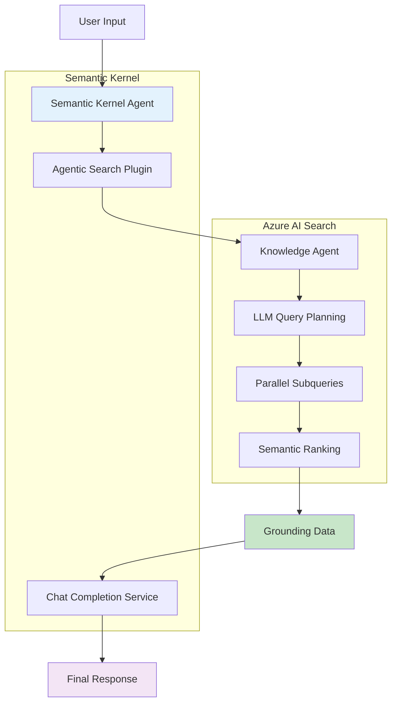

# Semantic Kernel Integration
## Complete Chat Completion Pipeline

---

### 🔗 Connecting Agentic Search to Chat Completion

Semantic Kernel provides the orchestration layer to seamlessly integrate agentic search results with chat completion services, creating a complete RAG pipeline.



### 🧩 Semantic Kernel Plugin Implementation

#### **1. Agentic Search Plugin**

```csharp
using Microsoft.SemanticKernel;
using System.ComponentModel;

[Description("Provides intelligent search capabilities using agentic retrieval")]
public class AgenticSearchPlugin
{
    private readonly AgenticSearchService _searchService;
    private readonly ILogger<AgenticSearchPlugin> _logger;
    
    public AgenticSearchPlugin(
        AgenticSearchService searchService,
        ILogger<AgenticSearchPlugin> logger)
    {
        _searchService = searchService;
        _logger = logger;
    }
    
    [KernelFunction]
    [Description("Searches for information using AI-powered query understanding and parallel retrieval")]
    public async Task<string> SearchAsync(
        [Description("The search query or question")] string query,
        [Description("Previous conversation context")] string? chatHistory = null,
        [Description("Maximum number of results to return")] int maxResults = 10)
    {
        try
        {
            var chatMessages = ParseChatHistory(chatHistory);
            
            var request = new AgenticRetrievalRequest
            {
                Query = query,
                ChatHistory = chatMessages,
                MaxSubqueries = 5,
                MaxDocsPerSubquery = 50
            };
            
            var response = await _searchService.RetrieveAsync(request);
            
            // Format results for chat completion
            return FormatSearchResults(response);
        }
        catch (Exception ex)
        {
            _logger.LogError(ex, "Error in agentic search plugin");
            return "I apologize, but I encountered an error while searching for information.";
        }
    }
    
    private List<ChatMessage> ParseChatHistory(string? chatHistory)
    {
        if (string.IsNullOrEmpty(chatHistory))
            return new List<ChatMessage>();
            
        // Parse structured chat history
        return JsonSerializer.Deserialize<List<ChatMessage>>(chatHistory) ?? new List<ChatMessage>();
    }
    
    private string FormatSearchResults(AgenticRetrievalResponse response)
    {
        var formattedResult = new StringBuilder();
        
        // Primary content
        formattedResult.AppendLine("## Search Results");
        formattedResult.AppendLine(response.UnifiedResult);
        formattedResult.AppendLine();
        
        // References for grounding
        if (response.References.Any())
        {
            formattedResult.AppendLine("## Sources");
            foreach (var reference in response.References.Take(5))
            {
                formattedResult.AppendLine($"- **{reference.Title}** (Score: {reference.RelevanceScore:F2})");
                formattedResult.AppendLine($"  {reference.Content.Substring(0, Math.Min(200, reference.Content.Length))}...");
                if (!string.IsNullOrEmpty(reference.SourceUrl))
                    formattedResult.AppendLine($"  [Source]({reference.SourceUrl})");
                formattedResult.AppendLine();
            }
        }
        
        return formattedResult.ToString();
    }
}
```

#### **2. Semantic Kernel Service Configuration**

```csharp
public class ConversationalRAGService
{
    private readonly Kernel _kernel;
    private readonly IChatCompletionService _chatCompletion;
    private readonly AgenticSearchPlugin _searchPlugin;
    private readonly ChatHistory _chatHistory;
    
    public ConversationalRAGService(
        AgenticSearchService searchService,
        IConfiguration configuration)
    {
        // Configure Semantic Kernel
        var builder = Kernel.CreateBuilder();
        
        // Add OpenAI chat completion
        builder.AddAzureOpenAIChatCompletion(
            deploymentName: configuration["AzureOpenAI:ChatDeploymentName"],
            endpoint: configuration["AzureOpenAI:Endpoint"],
            credential: new DefaultAzureCredential());
        
        // Add agentic search plugin
        _searchPlugin = new AgenticSearchPlugin(searchService, 
            serviceProvider.GetRequiredService<ILogger<AgenticSearchPlugin>>());
        builder.Plugins.AddFromObject(_searchPlugin);
        
        _kernel = builder.Build();
        _chatCompletion = _kernel.GetRequiredService<IChatCompletionService>();
        _chatHistory = new ChatHistory();
        
        // Set system prompt
        _chatHistory.AddSystemMessage(@"
            You are a helpful AI assistant with access to intelligent search capabilities. 
            When users ask questions that require information lookup, use the SearchAsync function 
            to find relevant information. Always cite your sources and provide accurate, 
            contextual responses based on the search results.
            
            Guidelines:
            - Use search for factual questions and information requests
            - Include relevant details from search results
            - Cite sources when providing information
            - If search returns no results, acknowledge this clearly
            - Maintain conversation context across interactions
        ");
    }
    
    public async Task<string> ProcessMessageAsync(string userMessage)
    {
        // Add user message to chat history
        _chatHistory.AddUserMessage(userMessage);
        
        // Configure function calling settings
        var executionSettings = new OpenAIPromptExecutionSettings
        {
            ToolCallBehavior = ToolCallBehavior.AutoInvokeKernelFunctions,
            Temperature = 0.7,
            MaxTokens = 1000
        };
        
        // Get response from chat completion with function calling
        var response = await _chatCompletion.GetChatMessageContentAsync(
            _chatHistory, 
            executionSettings, 
            _kernel);
        
        // Add assistant response to chat history
        _chatHistory.AddAssistantMessage(response.Content ?? "");
        
        return response.Content ?? "";
    }
}
```

### 🎯 Complete Integration Example

#### **3. End-to-End Chat Controller**

```csharp
[ApiController]
[Route("api/[controller]")]
public class ChatController : ControllerBase
{
    private readonly ConversationalRAGService _ragService;
    private readonly ILogger<ChatController> _logger;
    
    public ChatController(
        ConversationalRAGService ragService,
        ILogger<ChatController> logger)
    {
        _ragService = ragService;
        _logger = logger;
    }
    
    [HttpPost("message")]
    public async Task<IActionResult> PostMessage([FromBody] ChatRequest request)
    {
        try
        {
            var response = await _ragService.ProcessMessageAsync(request.Message);
            
            return Ok(new ChatResponse 
            { 
                Message = response,
                Timestamp = DateTime.UtcNow
            });
        }
        catch (Exception ex)
        {
            _logger.LogError(ex, "Error processing chat message");
            return StatusCode(500, "An error occurred processing your message.");
        }
    }
}

public record ChatRequest(string Message);
public record ChatResponse(string Message, DateTime Timestamp);
```

#### **4. Advanced Function Calling with Context**

```csharp
public class AdvancedAgenticSearchPlugin : AgenticSearchPlugin
{
    [KernelFunction]
    [Description("Performs contextual search with conversation awareness")]
    public async Task<string> ContextualSearchAsync(
        [Description("The search query")] string query,
        [Description("Current conversation context")] KernelArguments context)
    {
        // Extract chat history from kernel context
        var chatHistory = ExtractChatHistoryFromContext(context);
        
        var request = new AgenticRetrievalRequest
        {
            Query = query,
            ChatHistory = chatHistory,
            MaxSubqueries = 3,
            MaxDocsPerSubquery = 30
        };
        
        var response = await _searchService.RetrieveAsync(request);
        
        // Include query execution details for transparency
        var result = new StringBuilder();
        result.AppendLine($"## Search Results for: \"{query}\"");
        result.AppendLine(response.UnifiedResult);
        
        if (response.Activities.Any())
        {
            result.AppendLine("\n### Search Strategy");
            foreach (var activity in response.Activities)
            {
                result.AppendLine($"- Subquery: \"{activity.Subquery}\" → {activity.ResultCount} results");
            }
        }
        
        return result.ToString();
    }
    
    private List<ChatMessage> ExtractChatHistoryFromContext(KernelArguments context)
    {
        // Extract from kernel context or use injected chat history service
        if (context.TryGetValue("chat_history", out var historyObj) && 
            historyObj is List<ChatMessage> history)
        {
            return history;
        }
        
        return new List<ChatMessage>();
    }
}
```

### 🚀 Performance Optimization Strategies

#### **1. Streaming Response Implementation**

```csharp
public class StreamingRAGService
{
    public async IAsyncEnumerable<string> ProcessMessageStreamAsync(
        string userMessage,
        [EnumeratorCancellation] CancellationToken cancellationToken = default)
    {
        // Start search in background
        var searchTask = _searchPlugin.SearchAsync(userMessage);
        
        // Begin streaming chat completion
        var executionSettings = new OpenAIPromptExecutionSettings
        {
            ToolCallBehavior = ToolCallBehavior.AutoInvokeKernelFunctions
        };
        
        await foreach (var chunk in _chatCompletion.GetStreamingChatMessageContentsAsync(
            _chatHistory, executionSettings, _kernel, cancellationToken))
        {
            if (!string.IsNullOrEmpty(chunk.Content))
            {
                yield return chunk.Content;
            }
        }
    }
}
```

#### **2. Caching Layer Integration**

```csharp
public class CachedAgenticSearchService : IAgenticSearchService
{
    private readonly AgenticSearchService _innerService;
    private readonly IMemoryCache _cache;
    
    public async Task<AgenticRetrievalResponse> RetrieveAsync(AgenticRetrievalRequest request)
    {
        var cacheKey = GenerateCacheKey(request);
        
        if (_cache.TryGetValue(cacheKey, out AgenticRetrievalResponse? cached))
        {
            return cached!;
        }
        
        var response = await _innerService.RetrieveAsync(request);
        
        _cache.Set(cacheKey, response, TimeSpan.FromMinutes(15));
        
        return response;
    }
}
```

### 🎪 Usage Examples

#### **Simple Q&A**
```
User: "What are the benefits of using Azure Container Apps?"
→ Agentic search finds relevant documentation
→ Chat completion synthesizes answer with citations
```

#### **Multi-turn Conversation**
```
User: "Tell me about serverless computing in Azure"
→ Search results about Azure Functions, Container Apps, Logic Apps

User: "Which one is best for event-driven workloads?"
→ Context-aware search focuses on event-driven scenarios
→ Comparative analysis based on previous context
```

#### **Complex Query Handling**
```
User: "I need a solution for processing images, storing metadata in a database, and sending notifications. What Azure services should I use and how do they integrate?"
→ Multiple subqueries for image processing, databases, notification services
→ Integration patterns and architecture recommendations
```

---

*🎉 You now have a complete agentic search implementation with Semantic Kernel integration!*
